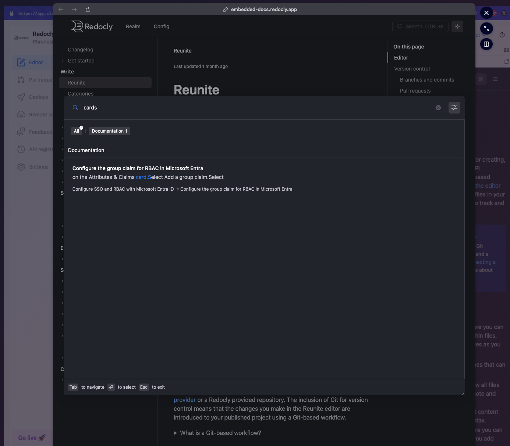
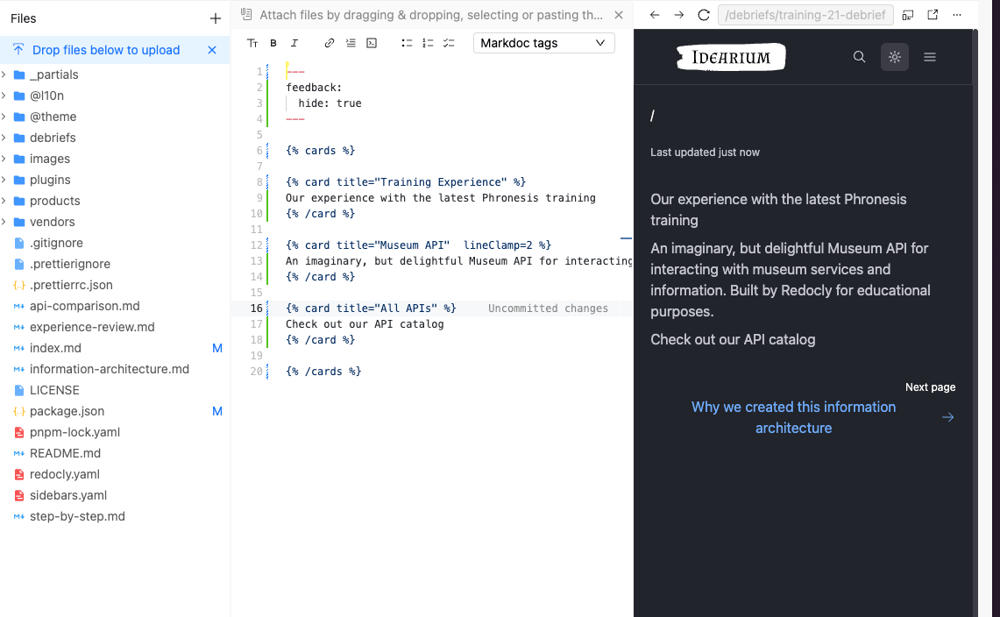
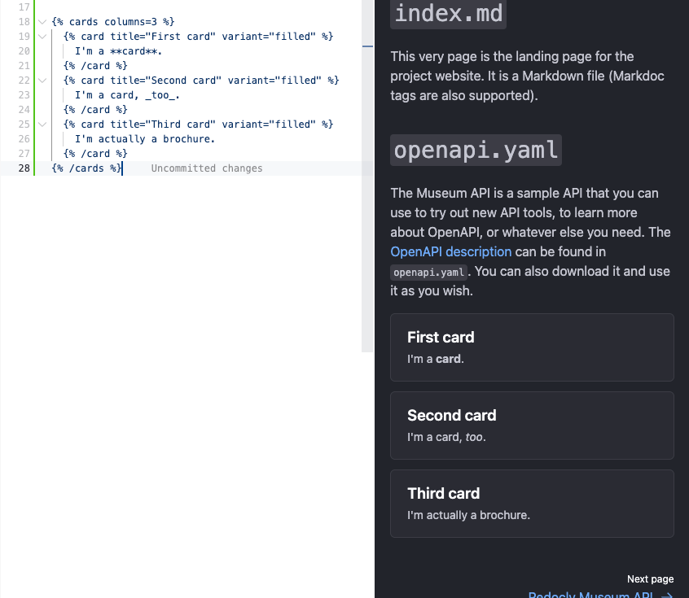
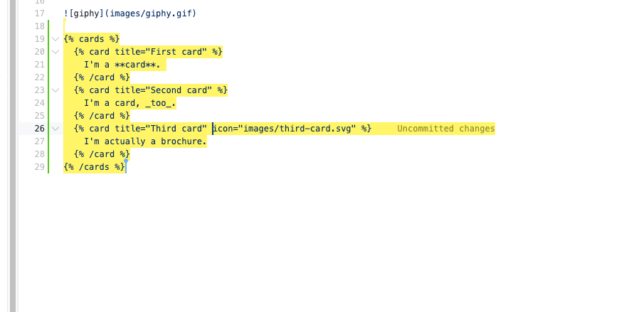
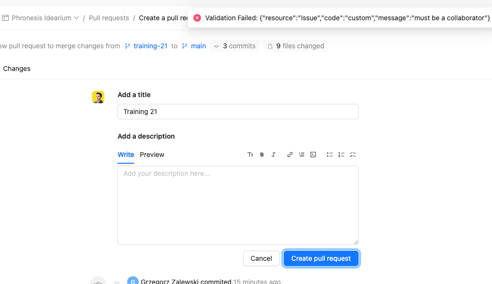

# Training 21 Debrief

## What made you smile?

* We found some rare issues that make us satisfied with this training.

## What did you find confusing?

* We can't find any documentation about cards in the Docs attached to Webview:

* Cards don't work for us at first try:

However, this works in a newly created project. There may be some configuration in Idearium that interferes with the card functionality and causes it to break

* Greg have an issue with acceability when he add some thext it become yellow and can't see what text is selected:

* Greg broke Pull request creation:
