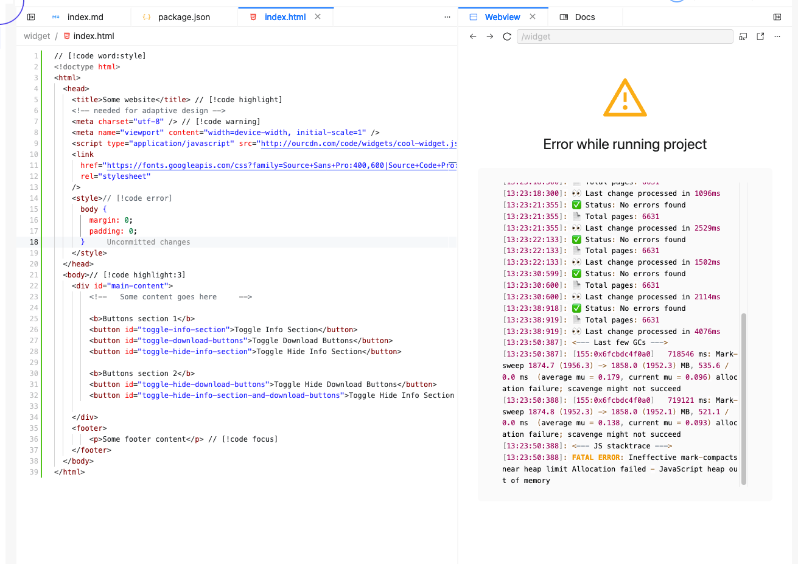
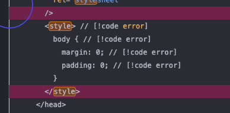
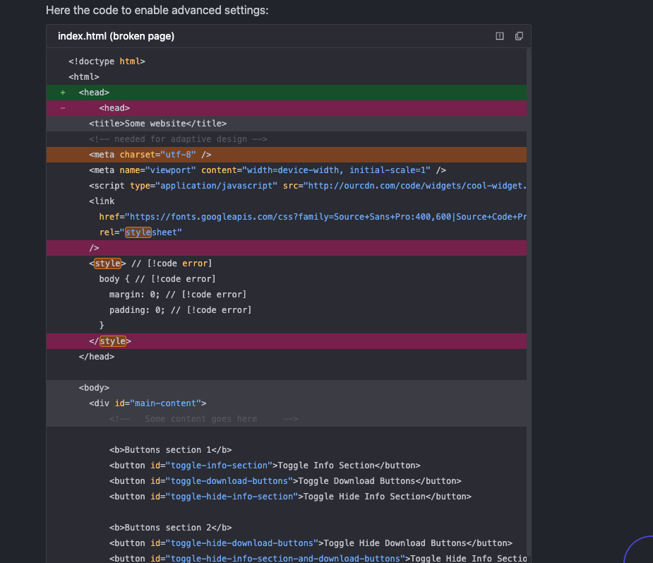

# Training 29 Debrief

## What made you smile?

* Trying the features was fun
* Can combine highlighing, for example: word + error/warning

## What did you find confusing?

* It would be nice to have an option to delete a branch together with the merge
* When creating new folders/files in the file tree, it is not always clear which folder is focussed
* On the diff screen right-click only opens context menu on the green area and when clicking on the red area, left-click opens a different context menu.

* After deleting files/folders with files that cause errors, the errors persist until project restart 
* Frequent consecutive changes to code highlighting caused OOM errors

* Error highlighting didin't work on `<style>`
  
* Error highlight colour is identical to deleted line colour on the default theme

## TODOs
